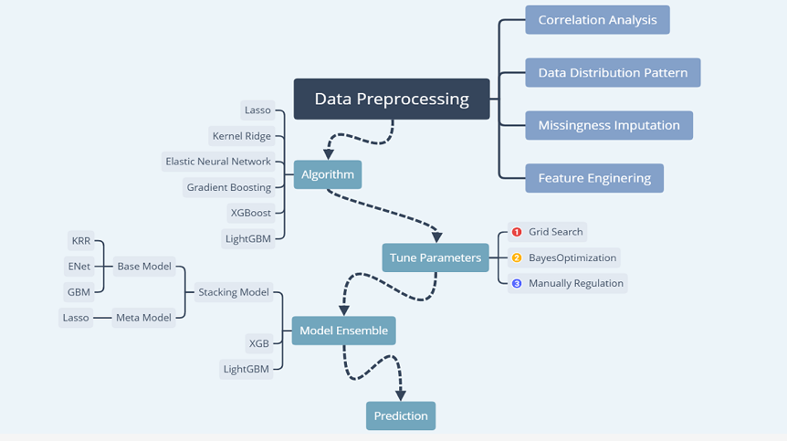
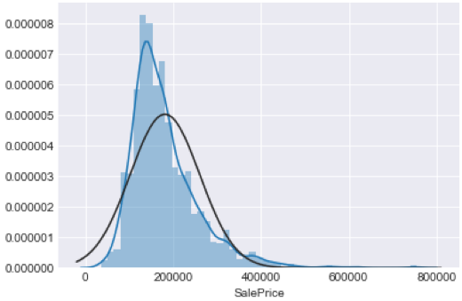
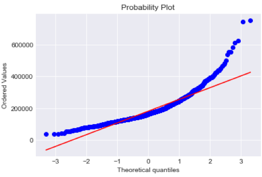
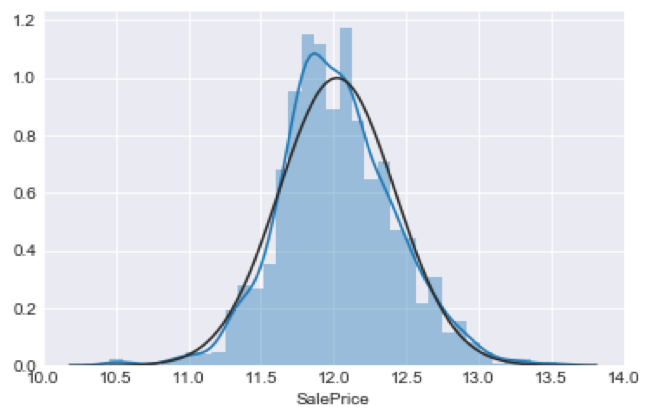
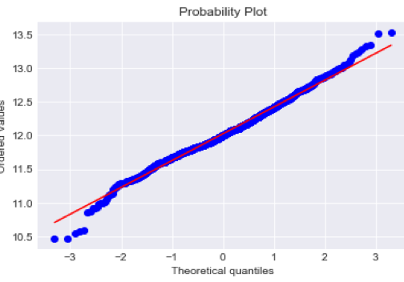
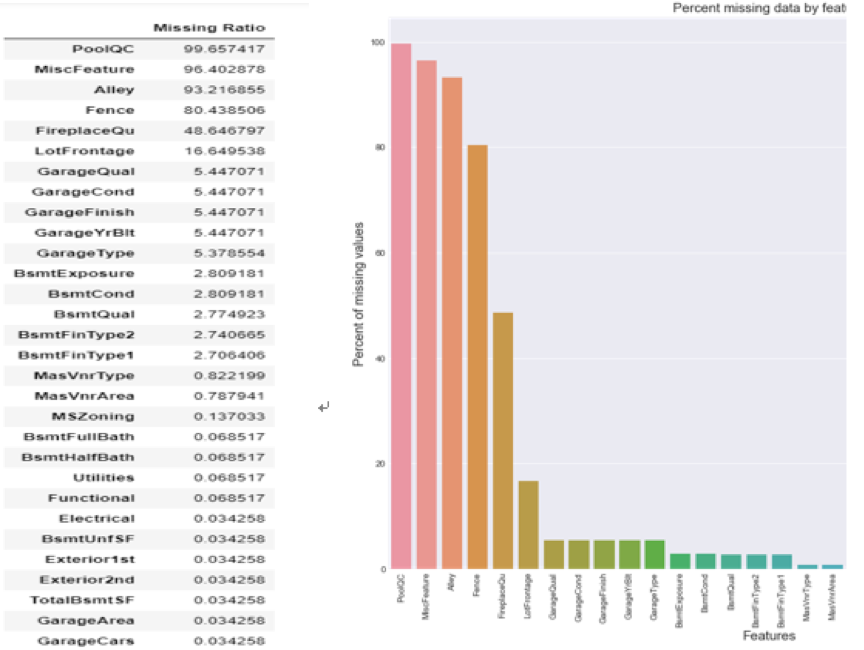
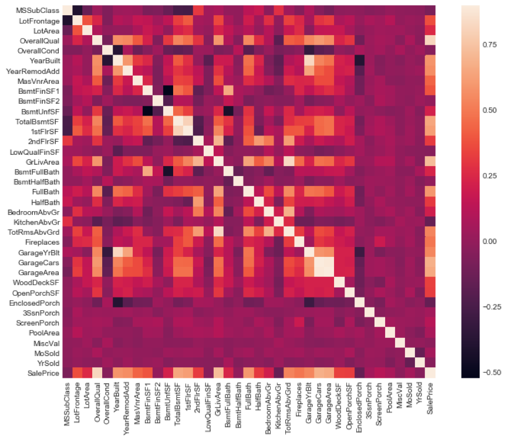

# House Prices: Advanced Regression Techniques

## Introduction

a practical competition whose goal is to predict house prices in Ames, Iowa using data covering the different features of the houses collected in 2010. There are 79 explanatory features describing every aspect of residential homes in Ames, Iowa. We considered this competition approachable because detailed explanations of the features had been provid-ed in full to the participants. It was an invaluable opportunity to both practice and hone our skills and knowledge of advanced machine learning, such as creative feature engi-neering and advanced regression techniques like random forest and gradient boosting. 

## Workflow
data preprocessing, machine learning models(lasso,kernel ridge, elsaticnet,gradient boosting), ensemble and stacking, prediciton and submission 

## Pre-Processing
### Data Distribution Pattern

Our aim is to predict the house price (abbreviated as HP), thus it’s important to determine the distribution of the HP of the sample. 

As shown in the first map below, the shaded blue area represents the HP density histo-gram plot, and the blue and black lines represent the HP density line and fitted HP density line respectively. It’s obvious that the distribution of the HP is not a normal one, which may cause considerable errors in our predictions. We can also infer this from the second map, which compares the theoretical quantile value with the real quantile value. We can see that most of the points are beyond the boundary, meaning that the distribution of HP is non-normal. 

This non-normal distribution shows a trailing trend, namely that most of the samples are clustering around the lesser values. Therefore, we can employ the cox-box method to handle this problem.

We can observe that the samples are close to the normal distribution after using the cox-box method.

### Missing Values

The next important process is dealing with missing values. In the code, it is easy to see that 30 columns contained missing values. We dealt with the missing values as the follow-ing table shows.

For the “None” group, which includes features such as ‘PoolQC’, ‘MiscFeature’, ‘Alley’, ‘Fence’, ‘FireplaceQu’, etc, missing values perhaps occur because most of the houses don’t have these facilities, which may cause ‘missing’. It is therefore safe to fill the NA with “None”. 
Secondly, for those houses with no basement, garage, or wall cladding, this may also cause missing values to occur, as can be seen in the features 'GarageYrBlt, 'BsmtFinSF1', 'BsmtFinSF2', etc. So we fix them with the value 0.

By observing the feature ‘MSZoning’, 'Electrical', 'KitchenQual', 'Exterior1st', 'SaleType', 'Exterior2nd', we can observe that all of them frequently show a value which is not de-termined by the sample’s other features. Therefore it’s a good idea to fill these missing values with the most frequent value within the sample.

The ‘LotFrontage’ usually shows a definite value in a definite area, thus we can simply fill in this feature’s missing value with a median value of this area which is grouped by ‘Neighborhood’. 

For the feature ‘Utilities’, all records are "AllPub", except for one "NoSeWa" and 2 NA . Since the house with 'NoSewa' is in the training set, this feature won't benefit our predic-tive model. We can then safely remove it for that very reason. 

We have officially filled in all the missing values.

## Correlation Analysis

In order to analyze the correlation between each feature and the housing price, we plotted the correlation heat map of these features. We discovered that some numerical features, which are correlate highly with the price. In particular, there are strong positive correla-tions between “TotaLBsmtSF” and “1stFlrSF”, as well as “GarageAreas” and “Gar-ageCars”. Such information is useful in determining the correlation of features and offer-ing evidences beneficial to performing imputations. We also know that multi-collinearity may make it more difficult to make inferences about the relationships between our inde-pendent and dependent variables.

## Feature Engineering

### TRANSFORMING THE DATA TYPE
In the algorithm to be applied next, the data type should be legal, which means that we should transform some of this data.
In one method, we  transferred some numeric features to categorical types  including 'MSSubClass', 'OverallCond', ‘'YrSold', 'MoSold'. 

Another way, which allows for categorical features with three or more classes, is to em-ploy the method of ‘LabelEncoder’ to transform them, which includes 'FireplaceQu', 'BsmtQual', 'BsmtCond', 'GarageQual', 'GarageCond', 'ExterQual', 'Exter-Cond','HeatingQC', 'PoolQC', 'KitchenQual', 'BsmtFinType1', 'BsmtFinType2', 'Functional', 'Fence', 'BsmtExposure', 'GarageFinish', 'LandSlope','LotShape', 'PavedDrive', 'Street', 'Al-ley', 'CentralAir', 'MSSubClass', 'OverallCond', 'YrSold', 'MoSold'. At last we implement ‘One-Hot-Encoding’ in order to make dummy variables out of all the categorical data which will have better effects on the algorithms.

### ADDING A NEW FEATURE
We know that the mean house price for different parts of the house is the same. In this way, we can combine the features 'TotalBsmtSF', '1stFlrSF', and '2ndFlrSF' into a new fea-ture, namely 'TotalSF'.

### FEATURE SKEWNESS
In most of the algorithms, data with Gauss distribution can minimize error. Thus, we need to discover the skewing feature and then correct it by calculating the relative asymmetry of the data.

We select the top 10 skewing features, all of which display high rates of skewness. For all of the numerical data within the data set, we set 0.75 as the threshold of the skewness. In this condition, we come to find that we have 59 features in total to be corrected. By his-tograming the density map of the features, we can employ box-cox as our method to cor-rect the skewing (LAM = 0.15).

##	Models
### Elastic Net
In statistics, and in particular the fitting of linear or logistic regression models, the elastic net is a regularized regression method that linearly combines the lasso and ridge methods.
There are two parameters we need to tune for: alpha, I1_ratio. 

Alpha: the constant that multiplies the penalty terms

I1_ratio: the ElasticNet mixing parameter, with 0 <= l1_ratio <= 1. For l1_ratio = 0, the penalty is an L2 penalty. For l1_ratio = 1 it is an L1 penalty. For 0 < l1_ratio < 1, the penalty is a combination of L1 and L2.

Based on the process, we decided: Alpha[0.001,0.1], I1_ratio[1,2]
We then added the new parameters “random_state”, the seed of the pseudo random num-ber generator that selects a random feature to update.
We used the MSE in order to judge the score and to discover the most ideal parameters.
table: tuning parameter, range, best value.
train   score

### GBM
The next step is to apply gradient boosting. There are 6 tuning parameters: n_estimators, learning_rate, max_depth, max_features, min_samples_leaf, min_samples_split. 

There are two types of parameter that we need to tune here, tree based and boosting pa-rameters. We knew that there were no optimum values for learning rates as low values always work better, given that we trained on a sufficient number of trees. While GBM is robust enough to prevent over-fitting within an increased number of trees, a high number for a particular learning rate can still lead to over-fitting. As we reduced the learning rate and increased trees, the computation took a long time to run and produce results.

In such a case, we adopted the following approach. Initially, we used 0.05, however it did not produce a favorable result. Thus, our second attempt saw us choosing the default val-ue of 0.1. Meanwhile, we lowered the learning rate and increased the estimators propor-tionally in order to produce more robust models. Additionally, it is worth mentioning that you should pay careful attention to the order of tuning variables. For example, the pa-rameters that exert greater impacts on the result should be tuned firstly, such as max_depth and min_samples_split, and then you could tune min_samples_leaf and max_features.

### KernelRidge
Let’s have a look at our liner machine learning model, Kernel Ridge Regression (KRR). KRR combines ridge regression (linear least squares with l2-norm regularization) with the kernel trick. It thus learns and adapts a linear function in the space induced by the respec-tive kernel and the data. For non-linear kernels, this corresponds to a non-linear function within the original space. In our case, there were four parameters, including alpha, ker-nel, degree and coef0. The table below is their definitions.

### Lasso
Lasso is a powerful technique generally used for creating parsimonious models in the presence of a large number of features. The loss function is based on the ‘Least squares’. Lasso adds the L1 penalty in order to penalize a large number of coefficients. What’s more, it can also minimize the coefficient to 0 when certain features fail to work within the model.
We used the grid search method to determine the parameter’s alpha value.
Lasso is a linear method, and therefore it can be used to enhance the generalization of the model in the sections of the samples where the price is highly related to the area of the house. But the actual model is so much more complicated than that, and thus we chose to use Lasso as the meta model for the stacking model, and the implementation has been a success, ultimately producing very accurate predictions. 

## Averaging Based Ensemble Methods and Stacked Ensemble Methods
The implementation of only one model cannot independently produce the best score, so we decided to ensemble all the models in order to figure out the best way to predict the outcomes.
5.1Simple averaging model
Within the simple averaging method, for every sample of test datasets, the average pre-dictions are calculated. This method often reduces over-fitting and creates a smoother regression model. The scoring method is MSE, and it turn out that the more linear the regression, the better the score is. Ultimately, the best score was produced by the com-bined efforts of lasso, elastic net, KRR, and GBoost
### Stacked:
changing the weight. We employed the following equation: “ensemble = stacked_pred*0.70 + averaged_pred*0.2 +xgb_pred*0.1”,  and after careful processing, the results were as follows: the first layer is made up of KRR, elastic net, and GBoost, and the second layer is lasso. In this way, the best score is achieved.