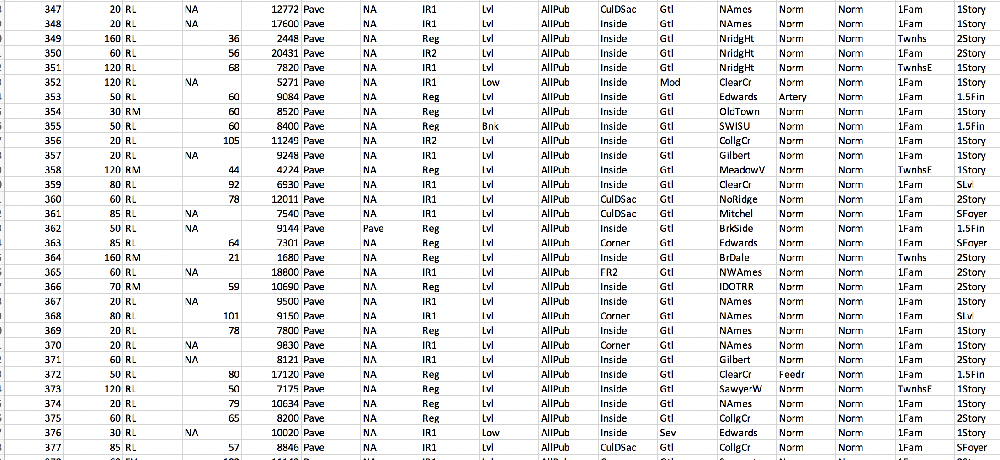
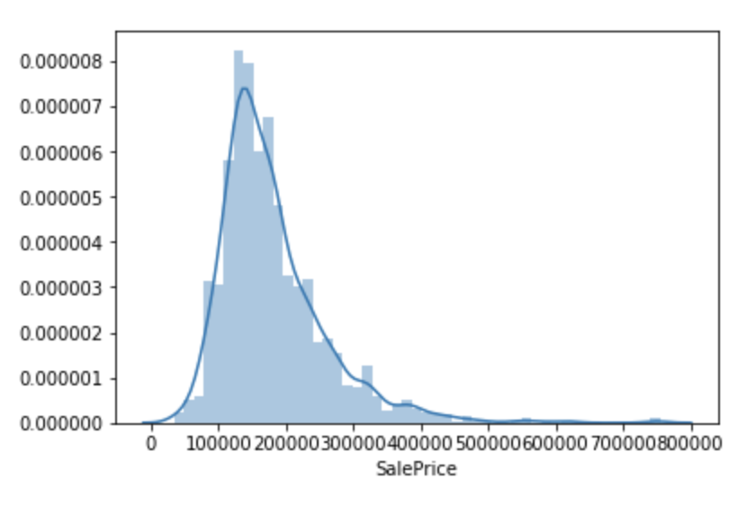
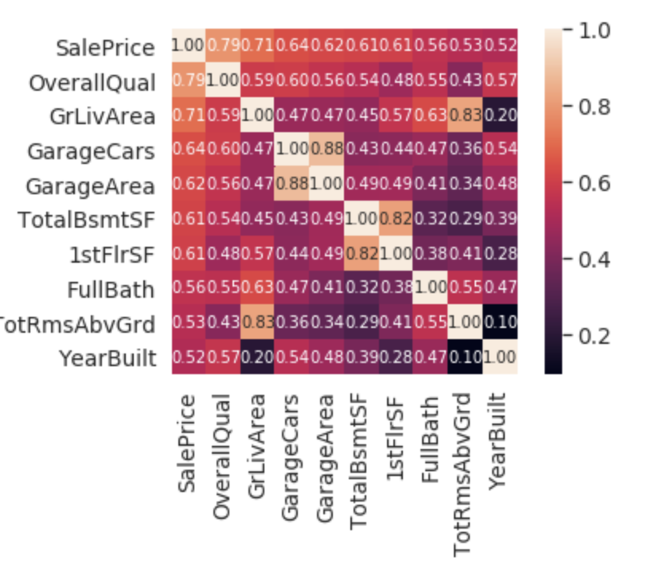

# Project 2: House Prices: Advanced Regression Techniques

## Background

Ask a home buyer to describe their dream house, and they probably won't begin with the height of the basement ceiling or the proximity to an east-west railroad. But this playground competition's dataset proves that much more influences price negotiations than the number of bedrooms or a white-picket fence.

With 79 explanatory variables describing (almost) every aspect of residential homes in Ames, Iowa, this competition challenges you to predict the final price of each home.

### Initial visualization

* A brief articulation of your chosen topic and rationale
Looking at housing data for Ames, Iowa. It's the most comprehensive data set we could. We'll be looking at correlations between various factors and their effect on housing price in that city.
A link to your dataset(s) and a screenshot of the metadata if it exists.

3-4 screenshots of relevant “inspiring” visualizations that frame your creative fodder
Possible animated scatterplot like the advanced section of the d3 homework.
A colored map of the most expensive neighborhoods similar to this:

